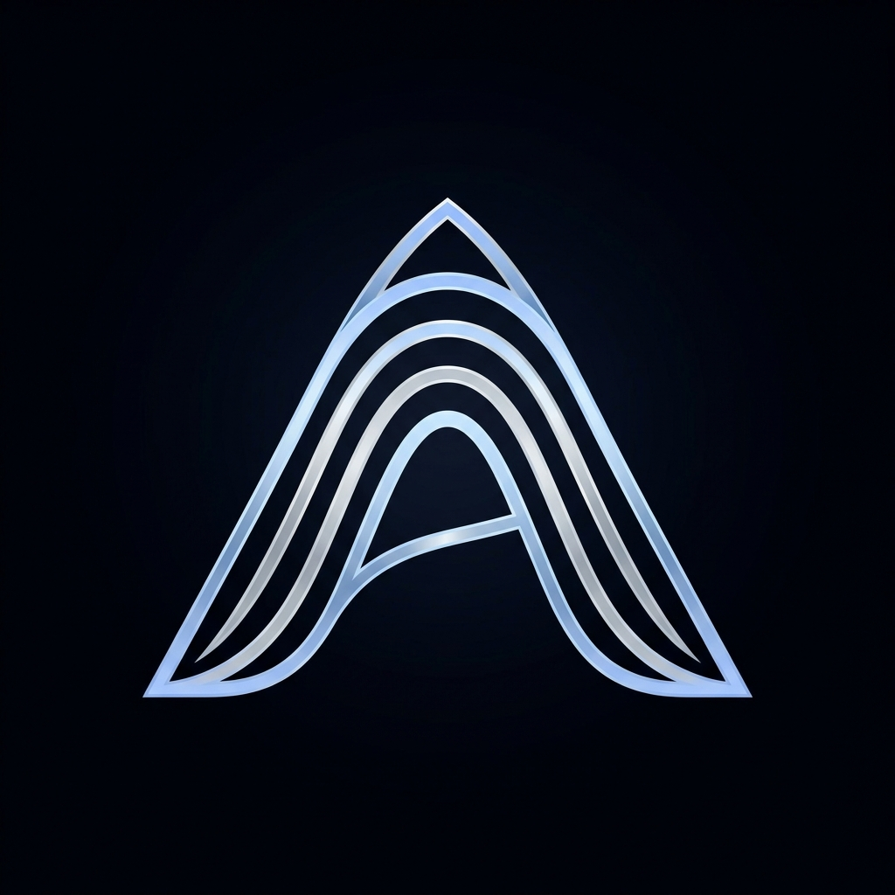
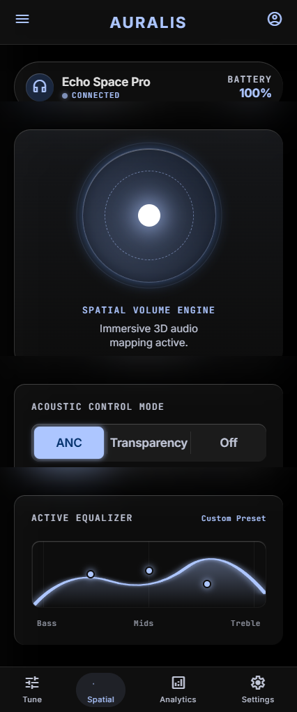
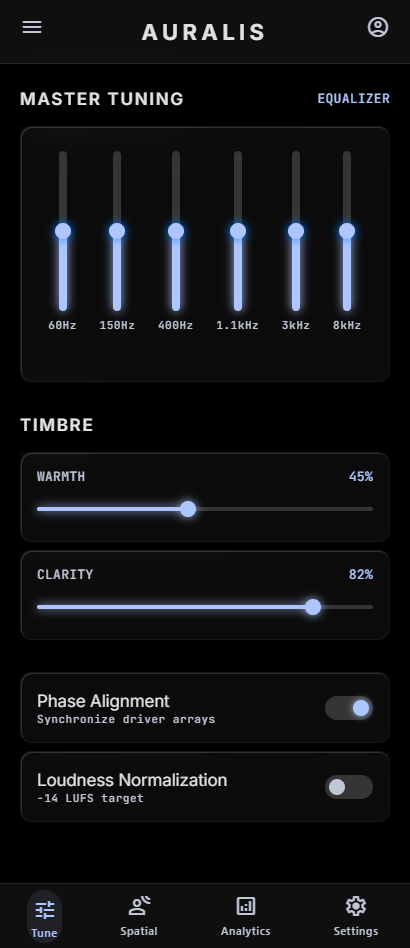
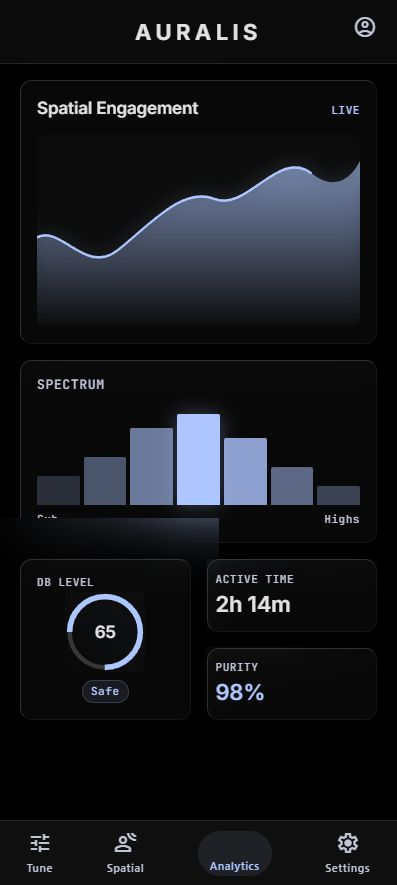
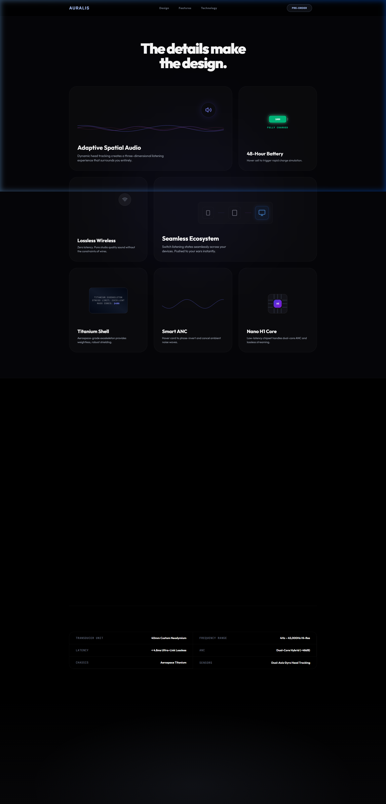
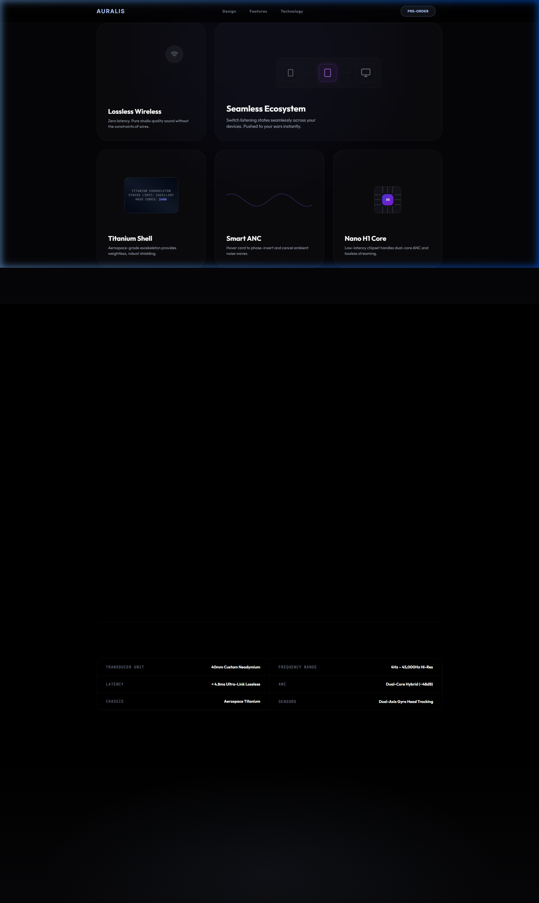

<div align="center">
  
  <h1>AURALIS</h1>
  <p><strong>The future of high-fidelity spatial audio.</strong></p>
  
  [](https://waleed-tahir.github.io/auralis_site/)
</div>

<br/>

## 🌐 Live Preview

Experience the live interactive prototype here:  
**👉 [https://waleed-tahir.github.io/auralis_site/](https://waleed-tahir.github.io/auralis_site/) 👈**

---

## ✨ Features & Showcases

Auralis is a meticulously designed marketing and product portfolio site built with React, Vite, and TailwindCSS. It features scroll-driven animations, an interactive iOS-style App Prototype, and complex isometric SVGs to showcase premium audio hardware.

### 1. Scroll-Driven App Timeline
An interactive 400vh scrolling container where the companion app seamlessly crossfades through various interfaces, including an animated Dynamic Island.

<br/>

### 2. Adaptive Spatial Audio Engine
Immersive 3D audio mapping with ANC mode selection.
<div align="center">
  
</div>

<br/>

### 3. Master Tuning & Equalizer
6-band equalizer with per-frequency precision control and timbre shaping.
<div align="center">
  
</div>

<br/>

### 4. Live Acoustic Analytics
Live spectrum analysis with dB levels, purity scores, and active time.
<div align="center">
  
</div>

---

## 🎨 Website Design

<div align="center">
  
  <br/><br/>
  
</div>

---

## 🛠️ Technology Stack

- **Framework**: React 19 + Vite
- **Styling**: TailwindCSS v4 with a custom premium "Ice & Silver" palette (`#ADC6FF`, `#C8CCD4`, `#050508`).
- **Icons**: Lucide React
- **Animations**: Custom scroll-linked intersection observers (`useElementScrollProgress`), Web Audio API synthetics, and CSS springs.

## 🚀 Local Development

1. **Clone the repository:**
   ```bash
   git clone https://github.com/waleed-tahir/auralis_site.git
   cd auralis_site
   ```
2. **Install dependencies:**
   ```bash
   npm install
   ```
3. **Run the development server:**
   ```bash
   npm run dev
   ```
4. **Build for production:**
   ```bash
   npm run build
   ```

## 📦 Deployment (GitHub Pages)

Deployment is automated using the `gh-pages` package. 
To manually trigger a deployment from your local machine:
```bash
npm run deploy
```
*Note: Ensure that the `base` property in `vite.config.js` is set to `./` so paths resolve correctly.*
